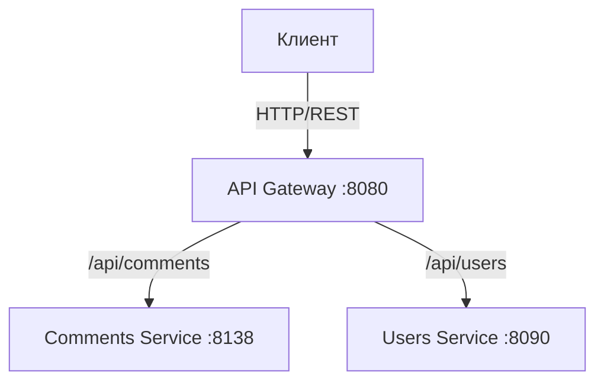

# Архитектура проекта: comments-s19

**Student:** s19
**Group:** 331
**Project Code:** comments-s19

## 1. Обзор системы

Финальный проект представляет собой микросервисную систему управления комментариями. Система состоит из двух микросервисов и API Gateway, объединённых в единую инфраструктуру.

### Компоненты

1. **Comments Service** (порт 8138) — основной сервис для CRUD операций над комментариями.
2. **Users Service** (порт 8090) — вспомогательный сервис для управления пользователями.
3. **API Gateway (Nginx)** (порт 8080) — единая точка входа, маршрутизация `/api/comments` и `/api/users`.

## 2. Диаграмма взаимодействия



## 3. Технологический стек

| Компонент | Технология | Обоснование |
|-----------|------------|-------------|
| Язык | Python 3.11 | Скорость разработки, асинхронность |
| Фреймворк | FastAPI | Производительность, автодокументация |
| Gateway | Nginx | Проверенный reverse-proxy |
| Протокол внешний | REST (JSON) | Универсальность, поддержка всеми HTTP-клиентами |
| Контейнеризация | Docker | Изоляция и воспроизводимость |
| Оркестрация | Docker Compose | Локальный запуск одной командой |

## 4. Ключевые решения

### 4.1. Протоколы
- Внешнее API — REST (JSON) через Nginx Gateway.
- Межсервисное взаимодействие не требуется — сервисы независимы.

### 4.2. Обработка ошибок
- Валидация входных данных через Pydantic (422 при некорректных данных).
- HTTP 404 при отсутствии ресурса.
- Healthcheck в docker-compose для контроля состояния сервисов.

### 4.3. Хранение данных
- In-memory хранилище (словарь Python) для каждого сервиса.

## 5. Инфраструктура

### Локальный запуск
```bash
docker-compose up --build
```

### Проверка
```bash
curl http://localhost:8080/api/comments
curl http://localhost:8080/api/users
```

### Продакшен (Kubernetes)
```bash
kubectl apply -f k8s/
```