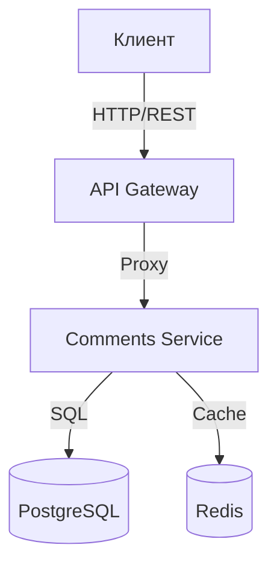

# Архитектура проекта: comments-s19

**Student:** s19  
**Group:** 331  
**Project Code:** comments-s19  

## 1. Обзор системы

Проект представляет собой микросервисную систему управления комментариями (`comments-s19`). Система позволяет пользователям создавать, читать и модерировать комментарии.

Архитектура состоит из следующих компонентов:
1. **API Gateway (Nginx)**: Маршрутизация запросов.
2. **Comments Service**: Бизнес-логика на FastAPI.
3. **Database (PostgreSQL)**: Хранение данных.
4. **Cache (Redis)**: Кэширование ответов.

## 2. Диаграмма взаимодействия



## 3. Технологический стек

| Компонент | Технология | Обоснование |
|-----------|------------|-------------|
| Язык | Python 3.11 | Скорость разработки, async support |
| Фреймворк | FastAPI | Производительность, авто-документация |
| БД | PostgreSQL | Надежность, ACID |
| Протокол | REST (JSON) | Универсальность для клиентов |
| Деплой | Docker + K8s | Масштабируемость и изоляция |

## 4. Ключевые решения

### 4.1. Протоколы
Для внешнего API выбран **REST**, так как это стандарт для веб-клиентов. Для внутреннего общения (если будет расширение) планируется **gRPC** для эффективности.

### 4.2. Отказоустойчивость
- **Health Checks**: Эндпоинты `/health` для Kubernetes.
- **Logging**: Структурированные логи для мониторинга.

## 5. Инфраструктура

### Локальный запуск
```bash
docker-compose up --build
```

### Продакшен (Kubernetes)
```bash
helm install comments-s19 ./chart -f values-prod.yaml
```

Используются **Rolling Updates** для обновления без простоя.

## 6. Безопасность
- Секреты вынесены в `.env` / K8s Secrets.
- Валидация ввода через Pydantic (защита от инъекций).
- Rate Limiting на Nginx.